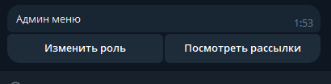
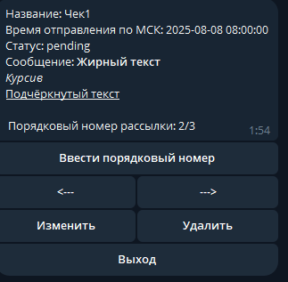
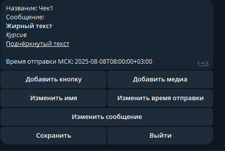

# VictoryGroup тестовый бот для рассылок

### Описание проекта

Два сервиса: бот на aiogram и API на FastAPI для рассылок подписавшимся на бота людям


Апи служит слоем между ботом и базой данных на PostgresQL

* Стэк
> FastAPI, SQLAlchemy, alembic, aiogram, APScheduler, httpx, Redis, PostgresQL, pipenv, black

### Подробнее про бота:
#### Команды:
1) **/start**


Базовая команда для подписки на бота. **Также служит как функция для регистрации админов: для регистрации 
необходимо перейти по ссылке https://t.me/{имя_вашего_бота}/start?={ключ_админа} после чего становятся доступны другие команды. Ключ админа задается config.py бота или в .env**

2) **/adminmenu**


Команда позволяющая провалиться в меню из двух выборов:
* Изменить роль юзера, подписанного на бота
* Просмотреть готовящиеся рассылки



Для первой команды необходимо будет знать ID пользователя, у которого будем менять роль


На второй команде мы запрашиваем у API все готовящиеся рассылки сортированные по предполагаемой дате отправления

* При просмотре доступна пагинация и навигация по порядковому номеру рассылки, можно перейти к конкретному номеру
* Есть возможность удалять рассылки и изменять их через переход к конструктору(о нём позже)
* При просмотре видно основное сообщение, которое будет в рассылке(с HTML разметкой), её внутреннее название(не будет видно при рассылке), а
также будут видны сущности, которые закреплены к этой рассылке: кнопки с ссылками, фото, гифки, видео и т.д.



3) **/newmailing**

Команда инициирующая создание новой рассылки

* При инициализации необходимо указать название для рассылки, основное сообщение и время отправки по МСК
* После чего становится доступно меню с добавлением кнопок и медиа к рассылке. Медиа вложение может быть только одно.
* Также становятся доступны кнопки изменения текущих данных
* При изменении кнопок их итоговый порядок будет сохранен
* Вся информация о рассылке хранится в кэше до момента отправки\сохранения или выхода из конструктора




#### Вспомогательные сущности бота
1) **MailingConstructor**

Класс отвечающий за создание рассылок внутри бота, отвечает за валидацию полей и конвертацию в нужную для API структуру для добавления

2) **MailingReader**

Класс отвечающий за рендеринг рассылок при просмотре из админ-меню

3) **ApiAccessor**

Класс для инкапсуляции работы с API

3) utils.py в директории bot

* Cобраны повторяющиеся куски кода в функциях
* Функции, помогающие строить клавиатуры
* make_safe_request - функция для безопасной работы с API


### Подробнее про API

#### Эндпоинты и доступ

* Все эндпоинты кроме документации закрыты на авторизацию по JWT токену
* JWT токен генерируется на основе SECRET_KEY стринги, она одна у бота и у API, таким образом доступ к сервису имеет только бот
* Документация по ссылке:
```bazaar
http://localhost:8000/docs
```
### Рассылки

* Рассылки реализованы на apscheduler - подключается в ивент луп fastapi и живет там, для рассылок(IO операций) самое то
* В шедулере только одна периодическая задача - проверка рассылок на необходимость начать их. После выполнения рассылки 
статистика отправляется модераторам в тг

#### Сущности для работы с рассылками

1) **MailingSendConverter** из scheduler

Класс для преобразования данных под API телеграмма

2) **MailingReport** из scheduler

Класс отвечающий за сбор статистики по рассылкам


## Запуск
### Для dev среды
1) Для корректной работы в dev средене необходимо будет внести подходящие дефолтные значения в файлах config.py в bot и backend
2) Для установки зависимостей из корневой директории:
```bazaar
pip install pipenv
pipenv shell
pipenv install
```
3) Необходимо будет поднять БД и Redis, где - на ваш вкус. И внести данные в конфиги
4) Накатить миграции. Из папки backend:
```bazaar
alembic upgrade head
```
5) Основные файлы запусков:
* main.py в backend для API
* bot.py в bot
```bazaar
uvicorn main:app --reload
python bot.py
```

### Запуск в Docker
1) Сконфигурировать .env по .env-example
2) Из корневой директории
```bazaar
docker-compose up -d --build
```

### Автор
Бушланов Глеб, TG: @serenityblood, mail: miracle_5@bk.ru
